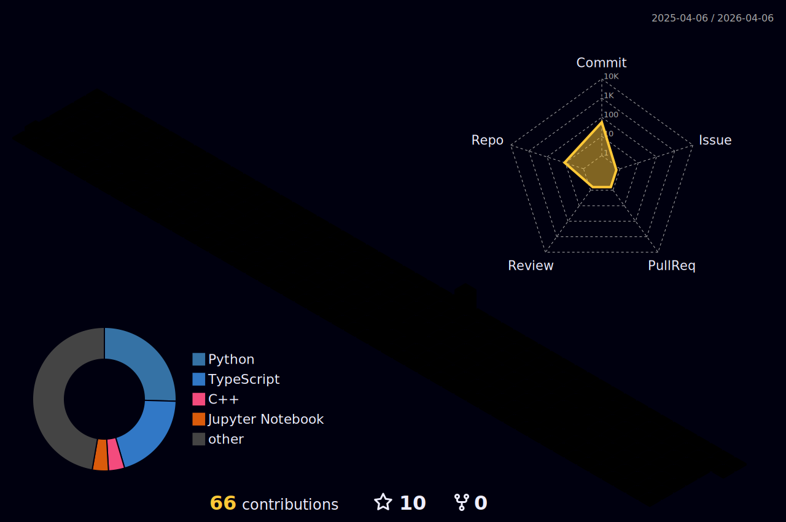

<!--
Profile README for @Norsaje (Kirill).
All widgets are image-only (safe in README). Optional GitHub Actions sections are commented with setup steps.
-->

<!-- ====== HEADER (Capsule Render) ====== -->

  

<!-- Language toggle (manual) -->

  Language: <b>EN</b> · <a href="./README_ru.md">RU</a>

<!-- Typing banner (the moving line you like) -->

  

<!-- ====== QUICK LINKS / BADGES ====== -->

  
  
  

---

### Hi — I’m Kirill.
I build **fast** ML systems. Realtime CV and LLM tooling, written like production code from day one: **data-centric** experiments, strong eval/guardrails, Docker-first, **offline-friendly**. When performance matters, I reach for **C++** (SIMD, cache-aware layouts, quantization); when shipping fast matters, it’s **Python** with clean APIs and tests.

- Recent focus: real-time **gesture recognition** & **generation** (UI + video rendering inside the app), **hallucination-resistant** LLM workflows, and **VRP-style** optimization experiments.  
- I like code that **explains itself**: simple interfaces, profiling before “optimizing,” fewer lines → more speed.

---

## Tech I reach for

  

---

## Selected work

  
  

  
  

---

## Metrics that matter

  
  

  

  

  

---

## What I’m into right now
- **Realtime CV** with clean UIs (video-in-UI, not external players), robust gesture detection, and low-latency pipelines.  
- **LLM reliability**: consistency checks, prompt defenses, and offline eval harnesses.  
- **C++/Python bridges**: speed where it counts, Python ergonomics where it helps.

---

## Contact
- 🌐 <a href="https://orvune.tech" target="_blank">orvune.tech</a>  
- 💬 Open an Issue in any repo — I reply fast.

---

<!-- ====== OPTIONAL INSANE EXTRAS (enable via Actions) ====== -->

<!-- 1) Contribution Snake (animated) — generates daily via GitHub Action -->
<!--
Add .github/workflows/snake.yml:

name: generate-snake
on:
  schedule: [{ cron: "0 18 * * *" }]  # daily, 18:00 UTC
  workflow_dispatch:
permissions: { contents: write }
jobs:
  build:
    runs-on: ubuntu-latest
    steps:
      - uses: Platane/snk/svg-only@v3
        with:
          github_user_name: ${{ github.repository_owner }}
          outputs: |
            dist/github-snake.svg
            dist/github-snake-dark.svg?palette=github-dark
      - uses: crazy-max/ghaction-github-pages@v4
        with:
          target_branch: output
          build_dir: dist
        env:
          GITHUB_TOKEN: ${{ secrets.GITHUB_TOKEN }}

Then un-comment the block below:

  <picture>
    <source media="(prefers-color-scheme: dark)" srcset="https://raw.githubusercontent.com/Norsaje/Norsaje/output/github-snake-dark.svg" />
    <source media="(prefers-color-scheme: light)" srcset="https://raw.githubusercontent.com/Norsaje/Norsaje/output/github-snake.svg" />
    
  </picture>

-->

<!-- 2) 3D Contributions panel (daily) -->
<!--
Add .github/workflows/profile-3d.yml:

name: GitHub-Profile-3D-Contrib
on:
  schedule: [{ cron: "0 18 * * *" }]
  workflow_dispatch:
permissions: { contents: write }
jobs:
  build:
    runs-on: ubuntu-latest
    steps:
      - uses: actions/checkout@v4
      - uses: yoshi389111/github-profile-3d-contrib@latest
        env:
          GITHUB_TOKEN: ${{ secrets.GITHUB_TOKEN }}
          USERNAME: ${{ github.repository_owner }}
      - name: Commit & Push
        run: |
          git config user.name github-actions
          git config user.email github-actions@github.com
          git add -A .
          if git commit -m "generated"; then git push; fi

Then embed (after first run):

  

-->

<!-- 3) lowlighter/metrics (big infographic panel) -->
<!--
Add .github/workflows/metrics.yml with the action from repo docs.
Once it generates `metrics.svg`, embed:

  

-->

<!-- ====== FOOTER (Capsule Render) ====== -->

  

