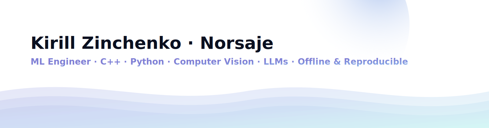

<!-- Профильный README для @Norsaje (Кирилл). Все вставки ниже безопасны для GitHub. -->

<!-- ======================= ПЕРЕКЛЮЧАТЕЛЬ ЯЗЫКА ======================= -->

  
  
   
  Переключите язык выше

<!-- ======================= ДИНАМИЧЕСКИЙ ХЕДЕР ======================= -->

  <picture>
    <source media="(prefers-color-scheme: dark)" srcset="https://capsule-render.vercel.app/api?type=waving&height=260&section=header&color=0:1e3c72,100:2a5298&text=Kirill%20Zinchenko%20%E2%80%94%20Norsaje&fontColor=ffffff&fontSize=44&fontAlignY=38&desc=ML%20Engineer%20%C2%B7%20C%2B%2B%20%C2%B7%20Python%20%C2%B7%20CV%20%C2%B7%20LLMs&descAlignY=56&descSize=20&animation=twinkling" />
    <source media="(prefers-color-scheme: light)" srcset="https://capsule-render.vercel.app/api?type=waving&height=260&section=header&color=0:36d1dc,100:5b86e5&text=Kirill%20Zinchenko%20%E2%80%94%20Norsaje&fontColor=ffffff&fontSize=44&fontAlignY=38&desc=ML%20Engineer%20%C2%B7%20C%2B%2B%20%C2%B7%20Python%20%C2%B7%20CV%20%C2%B7%20LLMs&descAlignY=56&descSize=20&animation=twinkling" />
    
  </picture>

<!-- ===================== АНИМАЦИОННАЯ ПОЛОСА ================== -->

  

<!-- ======================= БЫСТРЫЕ ССЫЛКИ ================= -->

  
  

---

## Привет — я Кирилл
Делаю быстрые ML‑системы. Реалтайм‑CV и инструменты для LLM, которые ведут себя как прод‑код с первого дня: data‑centric эксперименты, строгая оценка/guardrails, Docker‑first, оффлайн‑friendly. Если есть миллисекунда — я её заберу.

- Фокус: realtime жесты (распознавание/генерация, видео в UI), устойчивые к галлюцинациям пайплайны LLM и задачи оптимизации (VRP‑класс).
- Принципы: профилировать перед оптимизацией, меньше кода — больше скорости, интерфейсы, которые объясняют себя сами.

---

## Технологии

  

---

## Выбранные проекты

  
  

  
  

---

## Метрики

  
  

  

  

  

---

## Контакты
- 📫 <a href="mailto:kirillzinchenko2006@gmail.com">kirillzinchenko2006@gmail.com</a>
- 💬 Создайте Issue в любом репозитории — отвечаю быстро.

---

<!-- ========== ДОПОЛНИТЕЛЬНО: МОЖНО ВКЛЮЧИТЬ ЧЕРЕЗ ACTIONS ========== -->

<!-- 1) Contribution Snake -->
<!-- Документация: https://github.com/Platane/snk -->
<!-- После настройки workflow (см. ниже) раскомментируйте блок:

  <picture>
    <source media="(prefers-color-scheme: dark)" srcset="https://raw.githubusercontent.com/Norsaje/Norsaje/output/github-snake-dark.svg" />
    <source media="(prefers-color-scheme: light)" srcset="https://raw.githubusercontent.com/Norsaje/Norsaje/output/github-snake.svg" />
    
  </picture>
-->

<!-- 2) 3D Contributions -->
<!-- Документация и примеры: https://github.com/yoshi389111/github-profile-3d-contrib -->
<!-- После первого запуска добавьте один из svg:

-->

<!-- 3) lowlighter/metrics -->
<!-- Документация: https://github.com/lowlighter/metrics -->
<!-- После генерации metrics.svg вставьте:

-->

